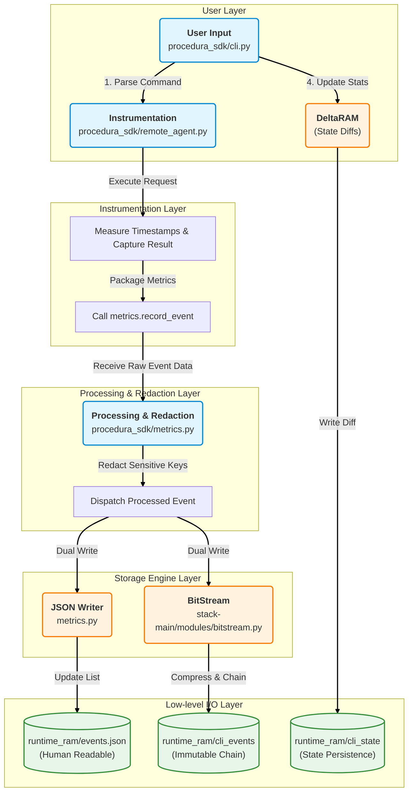

# Observability & Metrics

The Procedura SDK includes a built-in observability system that records CLI interactions, performance metrics, and state changes. This system is designed to be local-first, privacy-aware, and easy to inspect.

## System Architecture

The system operates in four distinct layers to ensure reliability and observability:

1.  **Interface Layer** (`procedura_sdk/cli.py`)
    *   Handles user commands (`login`, `run`, `stream`).
    *   Updates persistent usage statistics (e.g., `total_runs`) via **DeltaRAM** after execution.

2.  **Agent Layer** (`procedura_sdk/remote_agent.py`)
    *   Manages WebSocket connections and authentication.
    *   Measures critical timestamps (`start`, `ack`, `final`).
    *   Captures full results, including detailed error contexts (e.g., coordinates of a failure).

3.  **Observability Layer** (`procedura_sdk/metrics.py`)
    *   **Redaction**: Automatically sanitizes sensitive data (tokens, passwords).
    *   **Dual-Write**: Dispatches events to both the immutable chain (BitStream) and the human-readable file (`events.json`).

4.  **Storage Layer** (`stack-main/modules/` & `runtime_ram/`)
    *   **BitStream**: Append-only, compressed chain for immutable event history.
    *   **DeltaRAM**: Diff-based storage for current system state.

## Data Storage & Logic

We distinguish between **Events** (what happened) and **State** (current status).

### 1. Events (Immutable History)
*   **Storage**: `runtime_ram/cli_events` (BitStream) & `runtime_ram/events.json`
*   **Logic**: Every command execution creates a **new, complete record**. Even if you run the same command twice, two distinct events are recorded with unique timestamps and latencies.
*   **Format**:
    *   **BitStream**: Compressed (Zstd), chained blocks. The "source of truth".
    *   **events.json**: Plain JSON array. A mirror for easy inspection with text editors.

### 2. State (Current Status)
*   **Storage**: `runtime_ram/cli_state` (DeltaRAM)
*   **Logic**: Stores values that change over time (e.g., `cli_stats`, `last_login`).
*   **Mechanism**: **Diff-based**. Only the *changes* (deltas) between the current state and the previous state are written to disk, making it highly efficient for counters and status flags.

### 3. Application Logs (System Internals)
*   **Storage**: `logs/`
*   **Logic**: Separate from CLI events. These logs record the internal behavior of the `stack-main` core.
    *   `logs/system/`: General debug/info messages.
    *   `logs/prompts/`: Successful LLM prompts and responses.
    *   `logs/failures/`: Failed LLM calls and errors.
    *   `logs/story/`: UI story frames presented to the user.

## Inspecting Logs

### Option A: Using the Dump Tool (Recommended)

We provide a tool to inspect and export the recorded events from the compressed BitStream: `tools/events_dump.py`.

```bash
# Show the last 10 events
python3 tools/events_dump.py --last 10

# Export the latest 5 events (all commands) as CSV
python3 tools/events_dump.py --last 5 --csv > report.csv

# Export the latest 5 'login' events as CSV
python3 tools/events_dump.py --cmd login_password --last 5 --csv > report.csv

# Export the latest 5 'login' events as CSV
python3 tools/events_dump.py --cmd worldstate_snapshot --last 5 --csv > report.csv
```

### Option B: Inspecting State (DeltaRAM)

To inspect the persistent state (like usage stats) stored in DeltaRAM, use `tools/inspect_state.py`. This tool decodes the compressed chain files.

```bash
# Inspect all state files in the directory
python3 tools/inspect_state.py runtime_ram/cli_state
```

### Option C: Direct File Inspection

You can also directly view the plain-text log file using standard tools:

```bash
cat runtime_ram/events.json | jq
```

### Output Example (Error with Context)

The system captures full error contexts. For example, if a coordinate lookup fails:

```json
{
  "status": "error",
  "error": "No glyph_prompt found at this coordinate.",
  "result_summary": {
    "status": "error",
    "message": "No glyph_prompt found at this coordinate.",
    "coord": [-12817304, 4324025, 0]
  }
}
```

## Privacy & Redaction

Sensitive information is **automatically redacted** before being written to disk. The system scans arguments and result payloads for keys such as:

*   `password`
*   `token`, `session_token`, `access_token`
*   `secret`, `key`, `credential`
*   `authorization`

Redacted values are replaced with `<redacted>`.

## Internal Workflow Diagram



## Troubleshooting

If you see empty output from `events_dump.py`, ensure you have the required dependencies installed:

```bash
pip install zstandard
```

(The SDK uses Zstandard compression for log storage).
