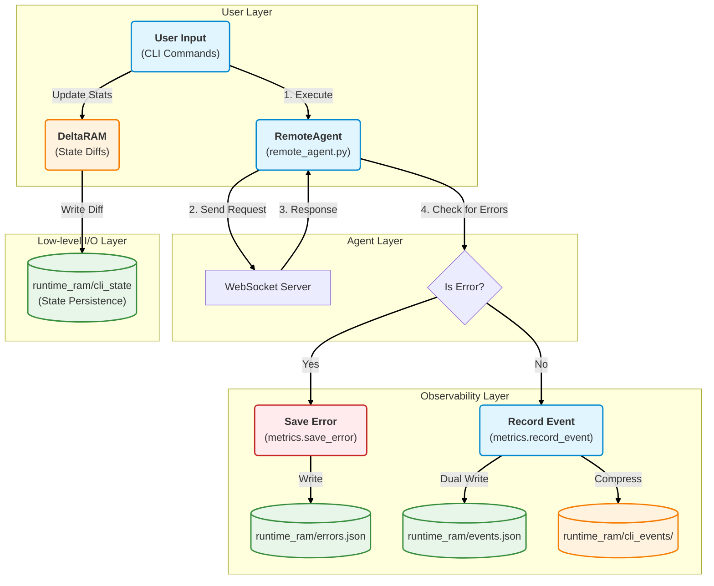

# Procedura Project Guide

Welcome to the Procedura Project Guide. This document is designed for both **new users** getting started with the SDK and **developers** looking to understand the internal observability and error logging systems.

---

## 1. Getting Started

The Procedura SDK allows you to interact with the remote world engine via a command-line interface (CLI).

### Installation
Ensure you have Python 3.10+ installed.

**Dependencies:**
*   `websockets >= 11.0, < 12.0`

```bash
# Install dependencies and the CLI tool
pip install -e .
```

### Basic Commands

All commands connect to the Procedura server. You can specify the server URL using the `--url` flag.
**Default URL:** `wss://vt.vm.scorchedserver.com:33000` (used in examples below).

#### 1. Login (`login`)
Authenticate with the server. This command exchanges your credentials for a session token and saves it locally (default: `~/.procedura/token`).

**Usage:**
```bash
procedura --url wss://vt.vm.scorchedserver.com:33000 login [CREDENTIAL] [OPTIONS]
```

**Arguments:**
*   `CREDENTIAL`: Your login string, typically `email:password`.
*   `--attach`: If set, attempts to attach to an existing session instead of replacing it.
*   `--ttl`: Session time-to-live in seconds .

**Example:**
```bash
# Login with a 2-hour session
procedura --url wss://vt.vm.scorchedserver.com:33000 login 'user@example.com:password' --ttl 7200
```

#### 2. Run a Command (`run`)
Execute a remote module synchronously. The CLI waits for the server to acknowledge the request and then waits for the final result.

**Usage:**
```bash
procedura --url wss://vt.vm.scorchedserver.com:33000 run [MODULE] [MODULE_ARGS...] [OPTIONS]
```

**Arguments:**
*   `MODULE`: The name of the remote module to execute (e.g., `worldstate_snapshot`).
*   `MODULE_ARGS`: Arguments passed directly to the module.
*   `--ack-timeout`: Seconds to wait for server acknowledgement (default: `10.0`).
*   `--final-timeout`: Seconds to wait for the job to complete (default: `600.0`).

**Example:**
```bash
# Take a snapshot of the current world state (terse mode)
procedura --url wss://vt.vm.scorchedserver.com:33000 run worldstate_snapshot --terse
```


---

## 2. Observability & Logging 

We prioritize transparency and debugging. The system uses a **Dual-Write** architecture to ensure data is both efficient for machines and readable for humans.

### 2.1 Event Logging 
Every command you execute is recorded. We store this data in two formats simultaneously:

1.  **`runtime_ram/cli_events/` (BitStream)**
    *   **Format**: Compressed (Zstandard), chained binary blocks.
    *   **Purpose**: Immutable, efficient, long-term storage. The "source of truth".
    *   **Tools**: Use `tools/events_dump.py` to read this.

2.  **`runtime_ram/events.json` (Human-Readable)**
    *   **Format**: Standard JSON array.
    *   **Purpose**: Instant debugging. You can open this file in VS Code to see exactly what happened.

### 2.2 Error Logging (Dedicated Channel)
To make debugging easier, we separate **errors** into their own dedicated log file. This allows you to quickly spot failures without digging through thousands of success events.

*   **File**: `runtime_ram/errors.json`
*   **Triggers**:
    1.  **Server Errors**: Any response with `"status": "error"`.
    2.  **CLI Exceptions**: Crashes or network failures in the client.
    3.  **Logic Failures**: Specific business logic checks (see below).

#### Special Case: Empty World Detection
The system automatically checks the integrity of `worldstate_snapshot`.
*   **Condition**: If the server returns a snapshot with an empty `entities` object (`{}`).
*   **Action**: This is treated as a critical failure.
*   **Log**: An error is recorded with code `EMPTY_WORLD` and message `"World not initialized: entities is empty"`.

**Example Error Entry:**
```json
{
  "timestamp": "2025-12-14T10:30:45.123456+00:00",
  "status": "error",
  "code": "EMPTY_WORLD",
  "message": "World not initialized: entities is empty",
  "cmd": "worldstate_snapshot",
  "result": { "entities": {}, ... }
}
```

### 2.3 Data Storage & Logic

We distinguish between **Events** (what happened) and **State** (current status).

*   **Events (Immutable History)**
    *   **Storage**: `runtime_ram/cli_events` (BitStream) & `runtime_ram/events.json`
    *   **Logic**: Every command execution creates a **new, complete record**. Even if you run the same command twice, two distinct events are recorded with unique timestamps and latencies.

*   **State (Current Status)**
    *   **Storage**: `runtime_ram/cli_state` (DeltaRAM)
    *   **Logic**: Stores values that change over time (e.g., `cli_stats`, `last_login`).
    *   **Mechanism**: **Diff-based**. Only the *changes* (deltas) between the current state and the previous state are written to disk.

*   **Application Logs (System Internals)**
    *   **Storage**: `logs/`
    *   **Logic**: Separate from CLI events. These logs record the internal behavior of the `stack-main` core (e.g., `logs/system/`, `logs/failures/`).

### 2.4 Privacy & Redaction
All logs are automatically sanitized. Sensitive keys (like `password`, `token`, `secret`) are replaced with `<redacted>` before being written to disk.

---

## 3. System Architecture

The system operates in four distinct layers to ensure reliability and observability:

1.  **Interface Layer** (`procedura_sdk/cli.py`): Handles user commands and updates persistent usage statistics via DeltaRAM.
2.  **Agent Layer** (`procedura_sdk/remote_agent.py`): Manages WebSocket connections, measures timestamps, and captures full results including error contexts.
3.  **Observability Layer** (`procedura_sdk/metrics.py`): Handles redaction and the dual-write dispatch to storage.
4.  **Storage Layer** (`stack-main/modules/` & `runtime_ram/`): Manages the BitStream (immutable chain) and DeltaRAM (state diffs).

### Workflow Diagram



---

## 4. Developer Tools

### Inspecting Events
Use the dump tool to export binary logs to CSV for analysis.

```bash
# Show the last 10 events
python3 tools/events_dump.py --last 10

# Export the latest 5 events (all commands) as CSV
python3 tools/events_dump.py --last 5 --csv > report.csv
```

### Inspecting State
View the persistent state (like usage statistics) stored in DeltaRAM.

```bash
# Inspect all state files in the directory
python3 tools/inspect_state.py runtime_ram/cli_state
```

### Troubleshooting
If you see empty output from `events_dump.py`, ensure you have the required dependencies installed:

```bash
pip install zstandard
```
